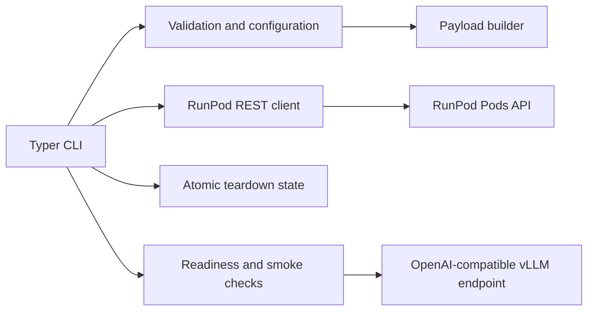

# RunPod vLLM Deployer

[](https://github.com/1solomonwakhungu/runpod-vllm-deployer/actions/workflows/ci.yml)
[](https://github.com/1solomonwakhungu/runpod-vllm-deployer/actions/workflows/security.yml)
[](https://www.python.org/)
[](LICENSE)

A safe, tested Python CLI for deploying and tearing down OpenAI-compatible vLLM servers on RunPod GPUs.

> Safety promise: `plan` is fully offline, `deploy` and `destroy` require confirmation, credentials are redacted, and teardown state is written as soon as RunPod returns a Pod ID.

GPU Pods are billable resources. Prices and availability change frequently. Review [RunPod's live GPU pricing](https://www.runpod.io/pricing) immediately before deploying.

## Features

- Offline validation and redacted deployment plans
- Explicit confirmation gates for billable creation and destructive teardown
- Current RunPod REST Pod payloads with a pinned vLLM image default
- A40, L40S, A100, H100, H200, and B200 GPU profiles
- Atomic local state with restrictive permissions where the platform supports them
- Health and model readiness checks with bounded timeouts
- Deterministic OpenAI-compatible smoke tests with optional bearer authentication
- Idempotent deletion for missing or already-terminated Pods
- Typed modules, mocked tests, strict linting, formatting, and type checking

## Architecture



See [Architecture](docs/architecture.md) for design boundaries and failure behavior.

## Installation

Python 3.11 or newer is required.

```bash
git clone https://github.com/1solomonwakhungu/runpod-vllm-deployer.git
cd runpod-vllm-deployer
python3 -m venv .venv
source .venv/bin/activate
python -m pip install .
runpod-vllm --help
```

For development, run `make setup` instead of `python -m pip install .`.

## Five-minute quickstart

1. Create a local environment file. It is ignored by Git.

   ```bash
   cp .env.example .env
   # Edit .env and set RUNPOD_API_KEY.
   ```

2. Generate an offline plan. This does not need an API key and makes no network request.

   ```bash
   runpod-vllm plan \
     --model ORG/MODEL \
     --gpu A40 \
     --max-model-len 8192
   ```

3. Create a Pod. This is billable and prompts for confirmation.

   ```bash
   runpod-vllm --env-file .env deploy \
     --model ORG/MODEL \
     --gpu A40 \
     --max-model-len 8192
   ```

4. Wait for vLLM and run a deterministic smoke test.

   ```bash
   runpod-vllm wait --timeout 900
   runpod-vllm smoke-test
   ```

5. Terminate the Pod and verify it is absent.

   ```bash
   runpod-vllm --env-file .env destroy
   ```

For an unattended deployment or teardown, add `--yes` only after reviewing the plan.

## Lifecycle walkthrough

| Command | Network | Mutates RunPod | Purpose |
| --- | --- | --- | --- |
| `plan` | No | No | Validate configuration and print a redacted payload |
| `deploy` | Yes | Yes, billable | Create a GPU Pod and immediately save teardown state |
| `status` | Yes | No | Inspect the recorded Pod and display access URLs |
| `wait` | Yes | No | Poll `/health` and `/v1/models` until ready |
| `smoke-test` | Yes | No | Send a four-token deterministic chat request |
| `list` | Yes | No | List active GPU Pods |
| `destroy` | Yes | Yes | Delete, verify absence, then remove matching state |

The default state file is `.runpod-vllm-state.json`. Use the global `--state-path PATH` option before the command when running more than one deployment from a directory.

If state persistence fails after creation, the CLI prints an explicit recovery command with the returned Pod ID. Run it promptly to stop billing.

## Supported configuration

The deployment commands support model and revision selection, GPU profile and count, tensor parallel size, context length, GPU memory utilization, dtype, quantization, KV cache dtype, trusted model code, reasoning parsers, container and Pod volume sizes, host CPU and RAM minimums, cloud type, data center restrictions, image override, port, and repeatable container environment variables.

The default image is `vllm/vllm-openai:v0.19.1`, pinned because that exact image was exercised by the technical reference deployment used to validate this project. Override it with `--image REPOSITORY:TAG`. `latest` is rejected.

GPU sizing is approximate and model-specific. Check the checkpoint documentation, quantization format, context requirements, tensor parallel compatibility, and current RunPod inventory before creating a Pod. A profile name does not promise that a model will fit.

See [Configuration](docs/configuration.md) for the complete option reference and [safe examples](examples/).

## Teardown

```bash
runpod-vllm --env-file .env status
runpod-vllm --env-file .env destroy
```

`destroy` waits until the Pod is absent before deleting local state. A 404 is treated as successful idempotent cleanup. Use `--pod-id POD_ID` only to recover from a state-write failure.

## Project layout

```text
src/runpod_vllm/   CLI, validation, API, state, payload, and readiness modules
tests/             Offline pytest suite with mocked HTTP behavior
docs/              Task-focused guides and design notes
examples/          Placeholder-only command and environment examples
scripts/           Repository safety checks
.github/           CI, security checks, templates, and dependency updates
```

## Testing

No test contacts RunPod.

```bash
make setup
make check
```

Individual targets are `make test`, `make lint`, `make format`, and `make typecheck`.

## Security

Credentials are loaded only from `RUNPOD_API_KEY`, optional `HF_TOKEN`, an endpoint token environment variable, or an explicitly selected `--env-file`. Values are never included in state. Plans and error text are redacted on a best-effort basis.

Read [Security](docs/security.md) before operating the CLI and report vulnerabilities through [GitHub Security Advisories](SECURITY.md).

## Troubleshooting

Start with [Troubleshooting](docs/troubleshooting.md). The most common causes are unavailable GPU inventory, a model that exceeds memory, gated checkpoint access, incompatible vLLM arguments, or a context length that is too large.

## Contributing

Contributions are welcome. Read [CONTRIBUTING.md](CONTRIBUTING.md) and the [Code of Conduct](CODE_OF_CONDUCT.md), then run `make check` before opening a pull request.

## License

Licensed under the [Apache License 2.0](LICENSE). Copyright 2026 Solomon Wakhungu.
