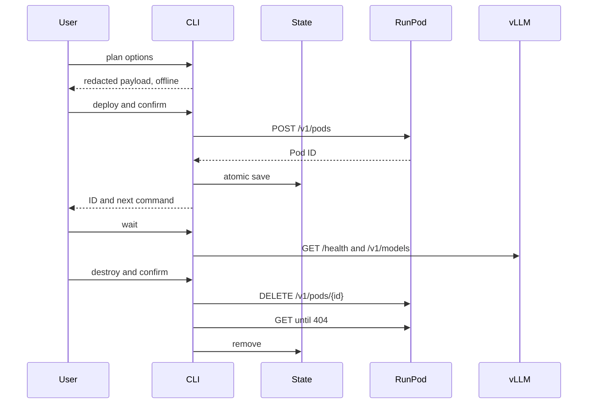

# Architecture

The package keeps unsafe boundaries narrow and testable.

| Module | Responsibility |
| --- | --- |
| `cli.py` | User interaction, confirmations, exit codes, and command orchestration |
| `config.py` | Input validation, GPU profiles, env-file loading, and name sanitization |
| `payload.py` | Pure construction of RunPod REST payloads and vLLM arguments |
| `client.py` | Authenticated RunPod REST requests and safe error translation |
| `models.py` | Typed state and readiness results |
| `state.py` | Atomic, restrictive, credential-free teardown state |
| `readiness.py` | Bounded health polling and deterministic endpoint smoke tests |
| `redaction.py` | Recursive structured redaction and safe diagnostics |
| `errors.py` | Domain errors and stable process exit codes |

## Data flow

## Failure strategy

Configuration fails before network activity. API and transport failures become concise domain errors with redacted URLs and bodies. Once creation returns an ID, state persistence is the highest-priority action. A failure at that point prints the ID and a direct cleanup command.

Deletion state is removed only after the provider reports the Pod absent. This makes retries safe and preserves the identifier needed to stop billing.

## API conventions

Pod creation uses the RunPod REST fields `imageName`, `gpuTypeIds`, `gpuCount`, `minVCPUPerGPU`, `minRAMPerGPU`, `dockerEntrypoint`, `dockerStartCmd`, `ports`, `cloudType`, and optional `dataCenterIds`. Read and delete operations use `/v1/pods/{podId}`. The implementation intentionally avoids the legacy GraphQL path.
