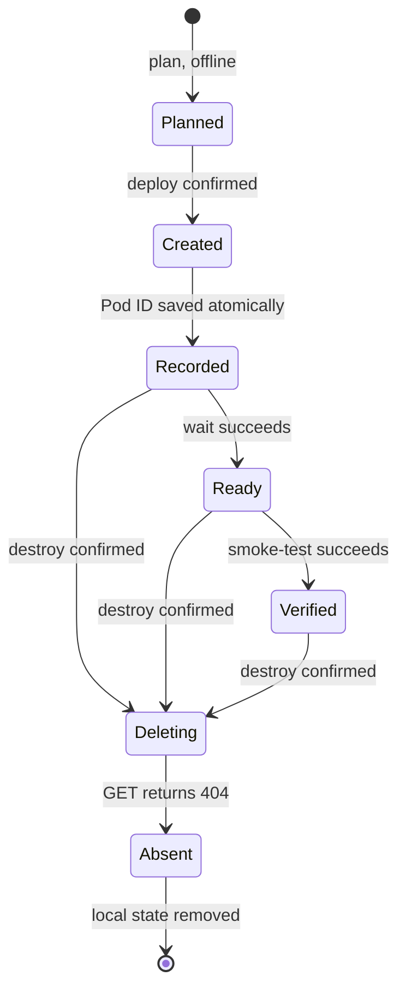

# Lifecycle and teardown safety

## State machine



## Billable boundary

Only `deploy` creates a resource. It requires an interactive confirmation unless `--yes` is present. `plan` never loads `RUNPOD_API_KEY` and never constructs an HTTP client.

GPU costs continue until the provider confirms termination. This project does not embed price estimates because pricing and inventory are volatile.

## Teardown-first state

After a successful create response, the CLI validates the returned Pod ID and writes local state using a same-directory temporary file, an atomic replace, and mode `0600` where portable. State never includes API keys, Hugging Face tokens, or endpoint bearer tokens.

If the state write fails, the CLI prints:

```text
runpod-vllm destroy --pod-id POD_ID --yes
```

Use that recovery path immediately. The explicit Pod ID option exists for this failure mode, not routine operation.

## Deletion verification

`destroy` sends `DELETE /pods/{podId}` and then reads the Pod until it is absent. A delete 404 or an already-absent Pod is successful and idempotent. If verification times out, local state remains so cleanup can be retried.

Use `--verify-timeout SECONDS` and `--verify-interval SECONDS` only when provider propagation requires adjustment.

## Multiple deployments

Keep one state file per Pod:

```bash
runpod-vllm --state-path .state/model-a.json --env-file .env deploy --model ORG/MODEL_A
runpod-vllm --state-path .state/model-b.json --env-file .env deploy --model ORG/MODEL_B
```

Add custom state directories to your local ignore rules if they do not match `*.runpod-vllm-state.json`.
